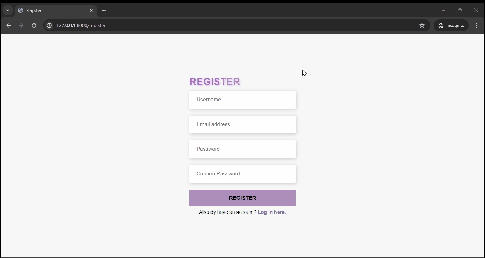
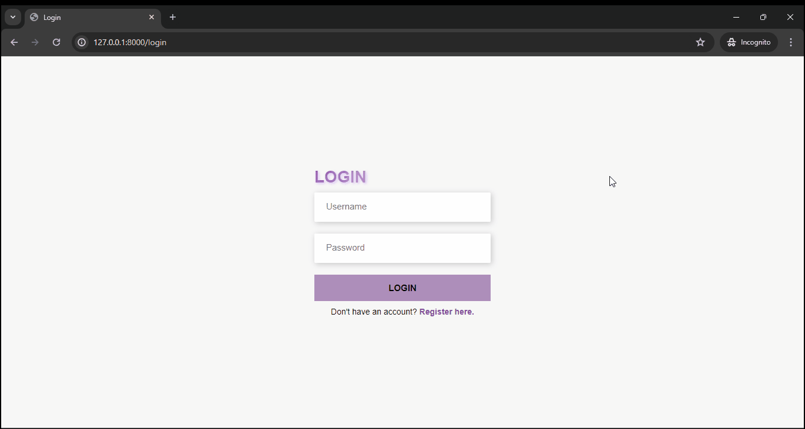
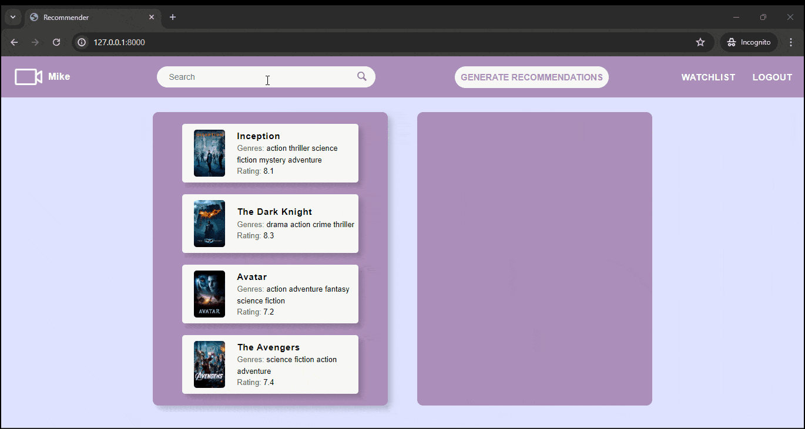
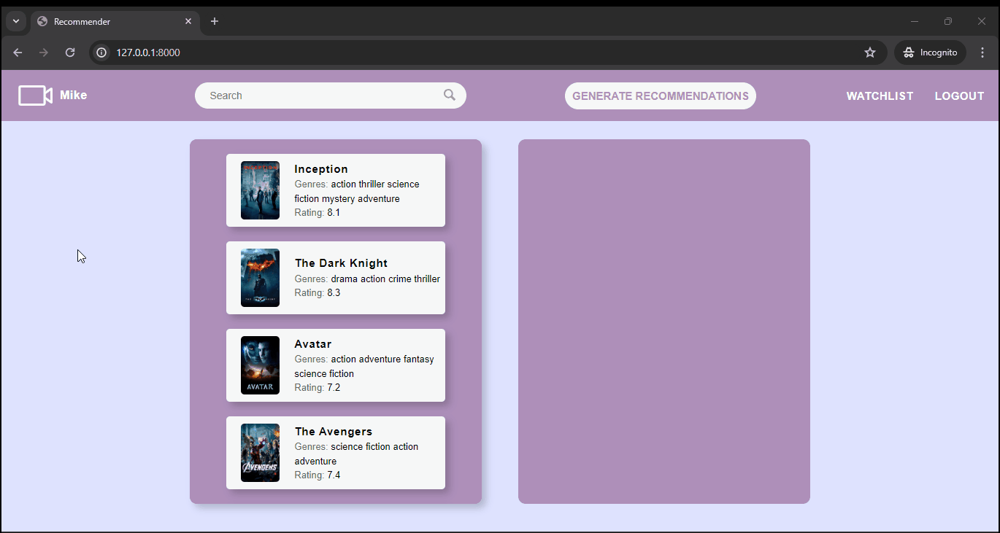
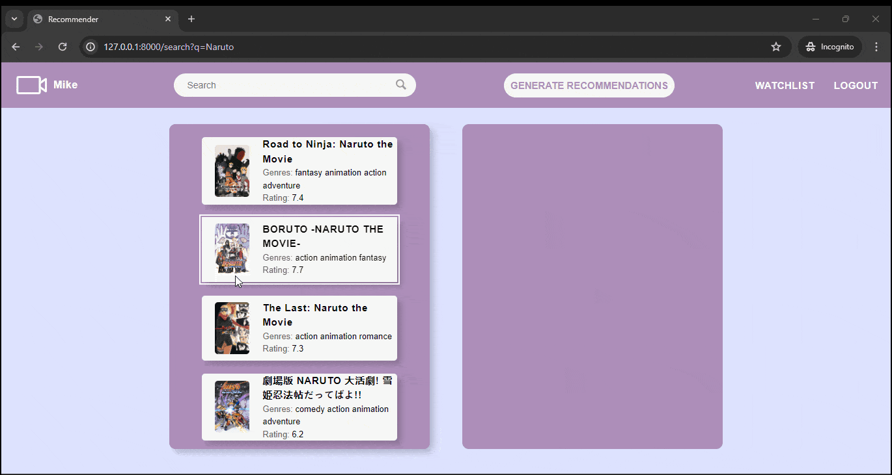

# Movie Recommender

## [Video Demo](https://youtu.be/XentZYtzTqE)

## Description

This is a web application that recommends movies using the Jaccard Similarity algorithm.

## File Structure

- `manage.py`: This is the command-line utility that lets you interact with this Django project.
- `movies.csv`: This CSV file contains the movie details which are loaded into the database.

## Installation and Setup

1. Install the necessary Python packages: `pip install -r requirements.txt
2. Make migrations first: `python manage.py makemigrations`
3. Apply the migrations: `python manage.py migrate`
4. Load the movies into the database: `python manage.py load_movies --path movies.csv`
   - 

## Usage

1. Registering an Account.

- 

2. User Login.

- 

3. Users can search for movies and select the ones they have watched.

- 

4. When a user clicks on a movie card, the details of that movie are displayed.

- 

5. Users can add and remove movies from their watchlist.

- 

6. This page contains all the movies the user has watched. Users can also remove movies from the watchlist.

- 

7. After adding the movies to watchlist, users can click on Generate Recommendations button to generate new unwatched movie recommendations. If its empty it will just suggest the popular shows in the database.

- 

## Algorithm Explanation

The Jaccard Similarity algorithm is used to recommend unwatched/new movies based on their similarity to the movies you've watched. The similarity between two movies is measured by comparing their genres. For example, if you've watched Action-Comedy movies, you're likely to watch other popular Action-Comedy movies. The similarity is calculated as follows:

Suppose we have movie1=[action comedy] and movie2=[action comedy drama] then

- sim(move1, movie2) = [action comedy]/[action comedy drama] = 2/3 (~66.7%)

So, if you've watched movie1 before, then you're likely to watch movie2 because it has similar genres (66.7%) with movie1
